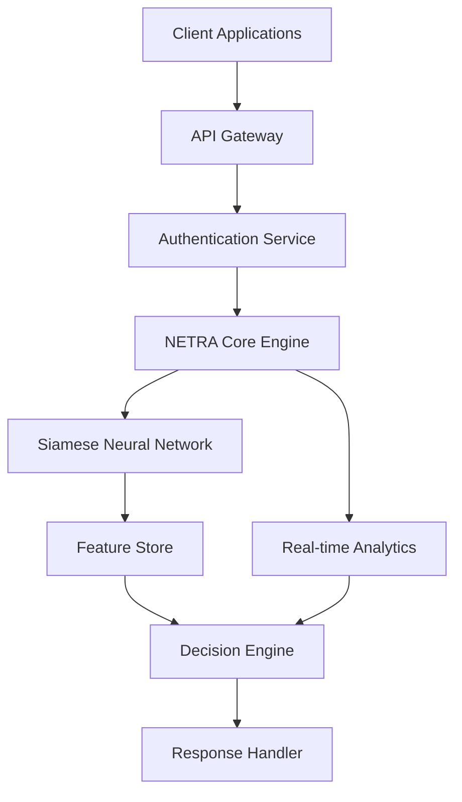

## 📁 Project Structure
# NETRA: Facial Recognition System

<div align="center">


**Enterprise-grade facial recognition using Siamese Neural Networks**

[🚀 Quick Start](#quick-start) • [📁 Project Structure](#project-structure) • [🏗️ Architecture](#architecture) • [🔧 API](#api) • [🐳 Deployment](#deployment)

</div>

## 📋 Table of Contents
- [Features](#features)
- [Quick Start](#quick-start)
- [Project Structure](#project-structure)
- [Architecture](#architecture)
- [API Documentation](#api-documentation)
- [Configuration](#configuration)
- [Deployment](#deployment)
- [Training](#training)
- [Monitoring](#monitoring)

## ✨ Features

- **High Accuracy**: >99% recognition with Siamese Networks
- **Real-time Processing**: <100ms inference time
- **Multi-face Detection**: Handle multiple faces in single image
- **REST API**: FastAPI with OpenAPI documentation
- **Docker Ready**: Containerized deployment
- **Kubernetes**: Production-ready orchestration
- **Monitoring**: Prometheus metrics & health checks
- **Security**: Anti-spoofing & encryption



## 🚀 Quick Start

### Prerequisites
```bash
Python 3.8+
Docker & Docker Compose
4GB+ RAM
```

### Installation
```bash
# Clone repository
git clone https://github.com/your-org/netra-facial-recognition.git
cd netra-facial-recognition

# Create virtual environment
python -m venv netra-env
source netra-env/bin/activate  # Windows: netra-env\Scripts\activate

# Install dependencies
pip install -r requirements.txt
```

### Run with Docker
```bash
# Start all services
docker-compose up -d

# Check service status
curl http://localhost:8000/health
```

### Run Locally
```bash
# Start the API server
python app/main.py

# Access API documentation
# http://localhost:8000/docs
```
🎨 High-Level Design
# System Architecture Overview
```
┌─────────────────────────────────────────────────────────────────────────────┐
│                             CLIENT LAYER                                    │
├─────────────────────────────────────────────────────────────────────────────┤
│  • Web Applications     • Mobile Apps      • CLI Tools                      │
│  • IoT Devices          • API Consumers    • Browser Clients                │
└─────────────────────────────────────────────────────────────────────────────┘
                                    │
                                    │ HTTPS/REST API
                                    ▼
┌─────────────────────────────────────────────────────────────────────────────┐
│                          APPLICATION LAYER                                  │
├─────────────────────────────────────────────────────────────────────────────┤
│  ┌─────────────────┐    ┌─────────────────┐    ┌─────────────────┐         │
│  │   FastAPI App   │    │   Health Checks │    │   Prometheus    │         │
│  │                 │    │                 │    │   Metrics       │         │
│  │ • /similarity   │    │ • /health       │    │ • /metrics      │         │
│  │ • /verify       │    │ • /ready        │    │                 │         │
│  └─────────────────┘    └─────────────────┘    └─────────────────┘         │
└─────────────────────────────────────────────────────────────────────────────┘
                                    │
                                    │ Internal Calls
                                    ▼
┌─────────────────────────────────────────────────────────────────────────────┐
│                           SERVICE LAYER                                     │
├─────────────────────────────────────────────────────────────────────────────┤
│  ┌─────────────────┐    ┌─────────────────┐    ┌─────────────────┐         │
│  │  Model Service  │    │  Preprocessing  │    │  Embedding      │         │
│  │                 │    │  Service        │    │  Service        │         │
│  │ • Siamese Net   │    │ • Face Detect   │    │ • Feature       │         │
│  │ • Inference     │    │ • Alignment     │    │   Extraction    │         │
│  │ • Similarity    │    │ • Normalization │    │ • Comparison    │         │
│  └─────────────────┘    └─────────────────┘    └─────────────────┘         │
└─────────────────────────────────────────────────────────────────────────────┘
                                    │
                                    │ Model Operations
                                    ▼
┌─────────────────────────────────────────────────────────────────────────────┐
│                           DATA LAYER                                        │
├─────────────────────────────────────────────────────────────────────────────┤
│  ┌─────────────────┐    ┌─────────────────┐    ┌─────────────────┐         │
│  │   Model Store   │    │  Configuration  │    │   Logging &     │         │
│  │                 │    │                 │    │   Monitoring    │         │
│  │ • siamese.pth   │    │ • config.yaml   │    │ • Application   │         │
│  │ • TorchScript   │    │ • Environment   │    │   Logs          │         │
│  │ • Quantized     │    │   Variables     │    │ • Performance   │         │
│  └─────────────────┘    └─────────────────┘    └─────────────────┘         │
└─────────────────────────────────────────────────────────────────────────────┘
```
# Data Flow Diagram
```
┌─────────────┐    Face Images    ┌─────────────┐    Preprocessed    ┌─────────────┐
│   Input     │ ────────────────► │ Preprocess  │ ────────────────► │  Siamese    │
│  Sources    │                   │   Module    │                   │   Model     │
│             │                   │             │                   │             │
│ • Webcam    │                   │ • Detect    │                   │ • Embedding │
│ • Upload    │                   │ • Align     │                   │   Generation│
│ • API Call  │                   │ • Normalize │                   │ • Similarity│
└─────────────┘                   └─────────────┘                   │  Scoring   │
                                                                     └─────────────┘
                                                                           │
                                                                           │ Embeddings
                                                                           ▼
┌─────────────┐    Comparison     ┌─────────────┐    Decision       ┌─────────────┐
│  Reference  │ ◄──────────────── │ Similarity  │ ◄──────────────── │   Output    │
│  Database   │                   │  Calculator │                   │   Module    │
│             │                   │             │                   │             │
│ • Known     │                   │ • Cosine    │                   │ • Match/    │
│   Faces     │                   │   Similarity│                   │   No Match  │
│ • Embeddings│                   │ • Euclidean │                   │ • Confidence│
│             │                   │   Distance  │                   │   Score     │
└─────────────┘                   └─────────────┘                   └─────────────┘
```
# Neural Network Architecture
```
┌─────────────────────────────────────────────────────────────────────────────┐
│                          Siamese Neural Network                            │
├─────────────────────────────────────────────────────────────────────────────┤
│                                                                             │
│  Input A (224x224x3)           Input B (224x224x3)                         │
│        │                              │                                     │
│        ▼                              ▼                                     │
│  ┌─────────────┐              ┌─────────────┐                              │
│  │   Backbone  │              │   Backbone  │                              │
│  │   CNN       │              │   CNN       │                              │
│  │ (Shared     │              │ (Shared     │                              │
│  │  Weights)   │              │  Weights)   │                              │
│  └─────────────┘              └─────────────┘                              │
│        │                              │                                     │
│        ▼                              ▼                                     │
│  ┌─────────────┐              ┌─────────────┐                              │
│  │  Embedding  │              │  Embedding  │                              │
│  │   Layer     │              │   Layer     │                              │
│  │   (128-d)   │              │   (128-d)   │                              │
│  └─────────────┘              └─────────────┘                              │
│        │                              │                                     │
│        └─────────────┐  ┌─────────────┘                                     │
│                      │  │                                                   │
│                      ▼  ▼                                                   │
│               ┌─────────────┐                                              │
│               │  Distance   │                                              │
│               │   Layer     │                                              │
│               │ (Contrastive│                                              │
│               │   Loss)     │                                              │
│               └─────────────┘                                              │
│                      │                                                     │
│                      ▼                                                     │
│               ┌─────────────┐                                              │
│               │  Similarity │                                              │
│               │   Score     │                                              │
│               │   (0-1)     │                                              │
│               └─────────────┘                                              │
└─────────────────────────────────────────────────────────────────────────────┘
```
# Training Pipeline Architecture
```
┌─────────────┐    Raw Images    ┌─────────────┐    Augmented     ┌─────────────┐
│ Training    │ ────────────────► │ Data       │ ────────────────► │ Model      │
│ Dataset     │                   │ Preprocess │                   │ Training   │
│             │                   │            │                   │            │
│ • Folder-   │                   │ • Face     │                   │ • Siamese  │
│   based     │                   │   Detection│                   │   Network  │
│ • Labeled   │                   │ • Data     │                   │ • Contrast-│
│   Pairs     │                   │   Augment- │                   │   ive Loss │
│             │                   │   ation    │                   │ • Optimizer│
└─────────────┘                   └─────────────┘                   └─────────────┘
                                                                           │
                                                                           │ Trained
                                                                           ▼ Model
┌─────────────┐    Evaluation    ┌─────────────┐    Optimized     ┌─────────────┐
│ Validation  │ ◄──────────────── │ Model      │ ◄──────────────── │ Model      │
│   Set       │                   │ Evaluation │                   │ Export     │
│             │                   │            │                   │            │
│ • Test      │                   │ • Accuracy │                   │ • PyTorch  │
│   Pairs     │                   │ • ROC      │                   │   .pth     │
│ • Negative  │                   │   Curve    │                   │ • Torch-   │
│   Samples   │                   │ • Confus-  │                   │   Script   │
│             │                   │   ion Matrix                   │ • Quantized│
└─────────────┘                   └─────────────┘                   └─────────────┘
```

## 📁 Project Structure

```
siamese-project/
├── app/                        # Core application
│   ├── main.py                # FastAPI application
│   ├── model.py               # Siamese Network model
│   ├── dataset.py             # Data loading & preprocessing
│   ├── preprocess.py          # Image preprocessing
│   ├── train.py               # Training pipeline
│   ├── utils.py               # Utilities & helpers
│   └── inference_client.py    # Example client
├── configs/
│   └── config.yaml            # Configuration
├── scripts/
│   ├── entrypoint.sh          # Container startup
│   └── evaluate.py            # Model evaluation
├── models/                    # Saved models
├── tests/                     # Unit tests
├── docker/                    # Docker configurations
├── k8s/                       # Kubernetes manifests
├── helm/                      # Helm charts
├── monitoring/                # Monitoring setup
└── torchscript/               # Model optimization
```

## 🏗️ Architecture

### System Overview
```
┌─────────────────┐    HTTP/REST    ┌─────────────────┐
│   Client Apps   │ ──────────────► │   FastAPI API   │
│                 │                 │                 │
│ • Web           │                 │ • /verify       │
│ • Mobile        │                 │ • /similarity   │
│ • CLI           │                 │ • /health       │
└─────────────────┘                 └─────────────────┘
                                              │
                                      ┌───────┼───────┐
                                      │       │       │
                                      ▼       ▼       ▼
                           ┌───────────┐ ┌─────────┐ ┌─────────┐
                           │ Siamese   │ │ Prepro- │ │  Model  │
                           │  Network  │ │ cessing │ │  Store  │
                           └───────────┘ └─────────┘ └─────────┘
```

### Neural Network Architecture
```python
# Siamese Network with shared weights
class SiameseNetwork(nn.Module):
    def __init__(self):
        self.backbone = CNN_Backbone()  # Shared weights
        self.embedding = nn.Linear(4096, 128)
    
    def forward_once(self, x):
        return self.embedding(self.backbone(x))
    
    def forward(self, input1, input2):
        output1 = self.forward_once(input1)
        output2 = self.forward_once(input2)
        return output1, output2
```

## 🔧 API Documentation

### Verify Faces
```bash
curl -X POST "http://localhost:8000/api/v1/verify" \
  -H "Content-Type: multipart/form-data" \
  -F "image1=@person1.jpg" \
  -F "image2=@person2.jpg" \
  -F "threshold=0.7"
```

**Response:**
```json
{
  "similarity_score": 0.8943,
  "is_match": true,
  "threshold_used": 0.7,
  "status": "success"
}
```

### Detect Faces
```bash
curl -X POST "http://localhost:8000/api/v1/detect" \
  -H "Content-Type: multipart/form-data" \
  -F "image=@group_photo.jpg"
```

**Response:**
```json
{
  "face_count": 3,
  "faces": [
    {
      "id": 0,
      "bbox": [100, 150, 200, 250],
      "confidence": 0.95,
      "area": 10000
    }
  ],
  "status": "success"
}
```

### Health Check
```bash
curl http://localhost:8000/health
```

**Response:**
```json
{
  "status": "healthy",
  "model_loaded": true,
  "timestamp": "2024-01-15T10:30:00"
}
```

## ⚙️ Configuration

### config.yaml
```yaml
app:
  host: "0.0.0.0"
  port: 8000
  workers: 4
  reload: true

model:
  path: "models/siamese.pth"
  embedding_dim: 128
  backbone: "resnet50"
  device: "auto"

training:
  epochs: 100
  batch_size: 32
  learning_rate: 0.001
  margin: 1.0

data:
  train_dir: "data/train"
  val_dir: "data/val"
  image_size: 160
```

## 🐳 Deployment

### Docker Compose
```yaml
# docker-compose.yml
version: '3.8'
services:
  netra-api:
    build: .
    ports:
      - "8000:8000"
    volumes:
      - ./models:/app/models
    environment:
      - CONFIG_PATH=configs/config.yaml
```

### Kubernetes
```bash
# Deploy to Kubernetes
kubectl apply -f k8s/deployment.yaml
kubectl apply -f k8s/service.yaml

# Check deployment
kubectl get pods -l app=netra
```

### Helm
```bash
# Install with Helm
helm install netra ./helm/

# Upgrade deployment
helm upgrade netra ./helm/
```

## 🎯 Training

### Prepare Data
```
data/
├── train/
│   ├── person1/
│   │   ├── image1.jpg
│   │   └── image2.jpg
│   └── person2/
│       ├── image1.jpg
│       └── image2.jpg
└── val/
    └── ...
```

### Start Training
```bash
python app/train.py --config configs/config.yaml

# With custom parameters
python app/train.py \
  --epochs 100 \
  --batch-size 32 \
  --learning-rate 0.001
```

### Training Output
```
Epoch 1/100: 100%|████| 500/500 [02:15<00:00]
Train Loss: 0.2154, Train Acc: 89.34%
Val Loss: 0.1987, Val Acc: 90.12%
```

## 📊 Monitoring

### Metrics Endpoint
```bash
curl http://localhost:8000/metrics
```

### Prometheus Integration
```yaml
# monitoring/prometheus.yml
scrape_configs:
  - job_name: 'netra'
    static_configs:
      - targets: ['netra-api:8000']
```

### Grafana Dashboard
Accessible at: `http://localhost:3000`

**Key Metrics:**
- API response time
- Request rate
- Error rate
- Model inference latency
- Memory usage

## 🧪 Testing

### Run Tests
```bash
# Install test dependencies
pip install -r requirements-dev.txt

# Run all tests
pytest tests/ -v

# Run specific test
pytest tests/test_model.py -v

# With coverage
pytest --cov=app tests/
```

### Test Examples
```python
def test_face_verification():
    client = TestClient(app)
    response = client.post("/api/v1/verify", files=files)
    assert response.status_code == 200
    assert "similarity_score" in response.json()
```

## 🔒 Security

### Features
- Input validation & sanitization
- Rate limiting
- Secure headers
- No raw image storage
- Encryption at rest

### Environment Variables
```bash
export NETRA_SECRET_KEY="your-secret-key"
export NETRA_DEBUG="False"
export NETRA_ALLOWED_HOSTS="localhost,127.0.0.1"
```

## 🤝 Contributing

1. Fork the repository
2. Create feature branch: `git checkout -b feature/amazing-feature`
3. Commit changes: `git commit -m 'Add amazing feature'`
4. Push to branch: `git push origin feature/amazing-feature`
5. Open Pull Request

### Development Setup
```bash
# Install development dependencies
pip install -r requirements-dev.txt

# Setup pre-commit hooks
pre-commit install

# Run linting
black app/ tests/
flake8 app/ tests/
```

## 📄 License

This project is licensed under the Apache 2.0 License - see the [LICENSE](LICENSE) file for details.

## 🆘 Support

- 📚 [Documentation](https://docs.netra.ai)
- 🐛 [Issue Tracker](https://github.com/your-org/netra/issues)
- 💬 [Discord Community](https://discord.gg/netra)
- 📧 [Email Support](mailto:support@netra.ai)

---

<div align="center">


[](https://star-history.com/#your-org/netra-facial-recognition&Date)

</div>
```
